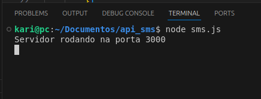
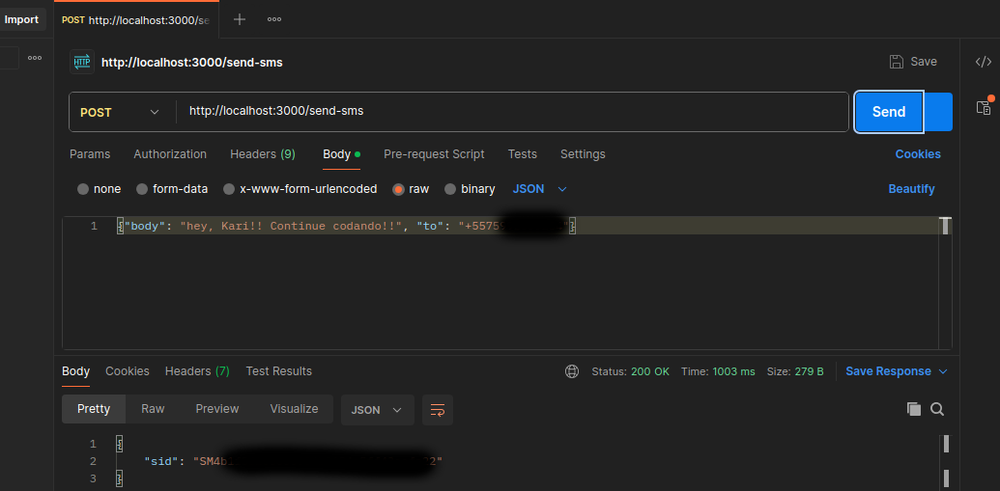

## Descrição

neste projeto, eu criei um servidor para enviar SMS utilizando a API da biblioteca Twilio

### importações

- `express`: framework que utilizo para criar o servidor
- `body-parser`: middleware que usei para interpretar o corpo das requisições como JSON
- `twilio`: biblioteca que utilizei para enviar mensagens SMS
- `dotenv`: Carreguei as variáveis de ambiente do arquivo `.env` para uma maior segurança

### configuração do servidor

- criei uma instância do aplicativo express
- configurei a porta do servidor 
- usei`body-parser` para interpretar o corpo das requisições como JSON

### configuração do twilio

- obtive as credenciais da Twilio (`accountSid`, `authToken` e `TWILIO_PHONE_NUMBER`) a partir das variáveis de ambiente

### rota `/send-sms`

- recebi as requisições POST com um corpo JSON contendo o texto da mensagem (`body`) e o número do celular (`to`)
- utilizo a biblioteca Twilio para criar uma mensagem SMS e enviá-la (me diverti bastante no processo)
- retornando o SID da mensagem 

### inicialização do servidor

- escutando na porta 3000 e exibindo uma mensagem de confirmação

## resumo das tecnologias utilizadas

- Node.js
- Express.js
- Twilio
- Postman

## clique nas imagens: 

  
  
  

